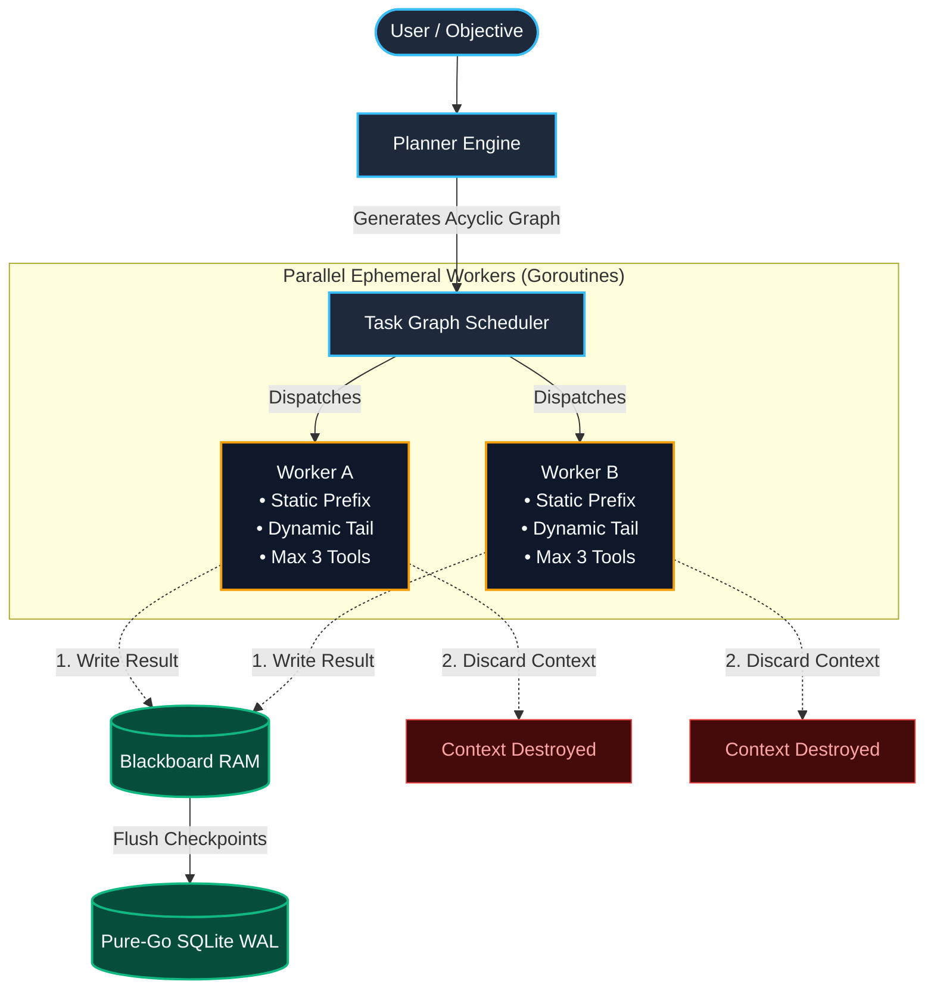
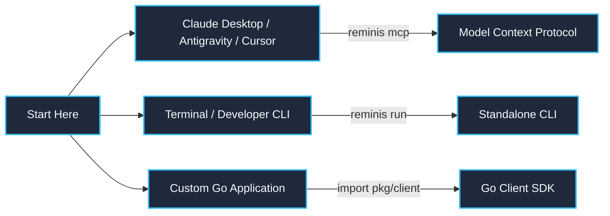
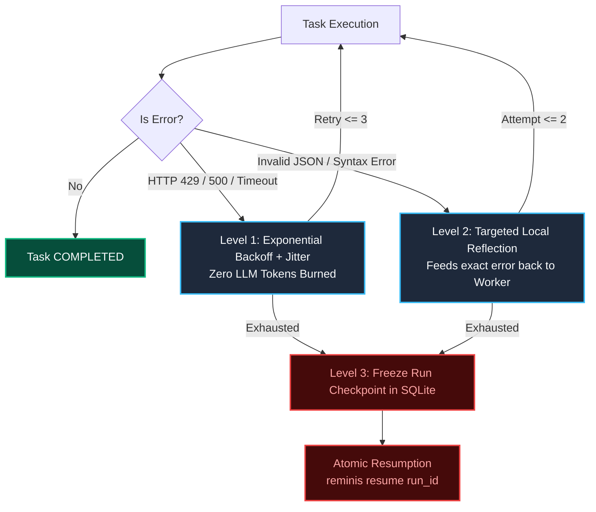
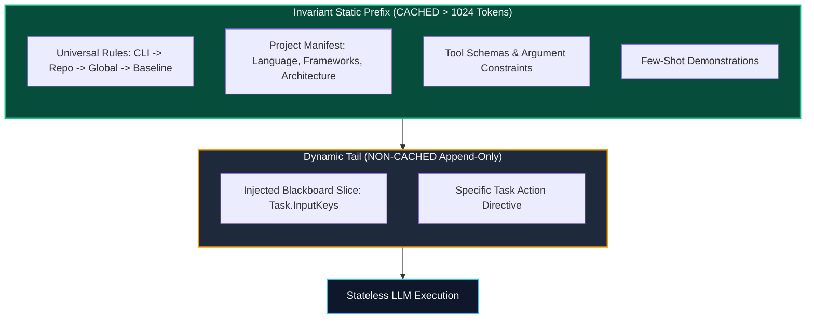
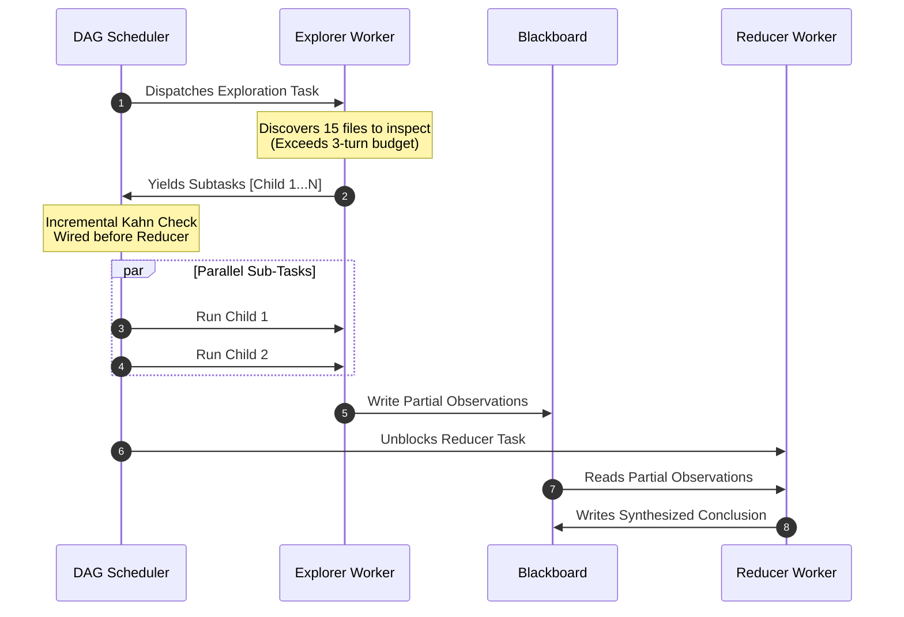

<div align="center">


# Reminis

**High-performance, concurrent OS-LLM agent memory layer and DAG orchestrator in pure Go.**

[](https://goreportcard.com/report/github.com/SalvucciFacundo/Reminis)
[](https://github.com/SalvucciFacundo/Reminis/releases/latest)
[](https://golang.org)
[](LICENSE)
[](https://modelcontextprotocol.io)

[Quickstart](#quickstart) • [Architecture](#the-os-llm-architecture) • [MCP Server](#model-context-protocol-mcp) • [Go SDK](#go-sdk-pkgclient) • [Documentation](#documentation)

</div>

---

## The Problem: Quadratic Context Bloat

Traditional ReAct agent loops append turns indefinitely into a single conversational window:

$$\text{Tokens}(N) \propto \sum_{i=1}^N \text{turn}_i \approx O(N^2)$$

By turn 30, re-sending tens of thousands of tokens exhausts API rate limits (TPM), degrades model attention (*lost-in-the-middle* failures), and spikes latency and costs.

## The Solution: The OS-LLM Architecture

Reminis decouples compute from state by mapping agent operations to classic operating system primitives:

| Primitive | Operating System | Reminis Implementation |
| :--- | :--- | :--- |
| **Compute** | **CPU** | **Stateless LLM**: Pure computation engine. Zero chat history carried between steps. |
| **Working Memory** | **RAM / L1** | **Blackboard**: Thread-safe key-value ledger (`sync.RWMutex`) with 4KB disk spillover. |
| **Persistence** | **Disk / File System** | **Pure-Go SQLite**: WAL-mode archival storage with serialized single-writer channel. |
| **Processes** | **Threads / Subprocesses** | **Ephemeral Workers**: Goroutines bounded to 3 tool calls; context discarded on return. |



---

## Quickstart

### 1. Installation

#### Precompiled Binaries
Download standalone binaries for Linux, macOS, and Windows directly from [GitHub Releases](https://github.com/SalvucciFacundo/Reminis/releases/latest).

#### Or via `go install`
```bash
go install github.com/SalvucciFacundo/Reminis/cmd/reminis@latest
```

### 2. Choose Your Integration



#### Option A: Run as an MCP Server (Antigravity, Claude Desktop, Cursor)
Add to your `claude_desktop_config.json` or Antigravity MCP settings:
```json
{
  "mcpServers": {
    "reminis": {
      "command": "reminis",
      "args": ["mcp"],
      "env": {
        "OPENAI_API_KEY": "sk-your-key"
      }
    }
  }
}
```

#### Option B: Standalone CLI
```bash
# Execute a goal with parallel workers
reminis run "Audit internal/store and generate benchmark tests" \
  --model gpt-4o \
  --max-concurrency 4

# Inspect the compiled rules prefix and prompt cache qualification
reminis prefix show

# Resume a checkpointed workflow
reminis resume run_a1b2c3d4
```

#### Option C: Go Library SDK
```go
c, _ := client.New(client.WithDBPath("reminis.db"), client.WithModel("gpt-4o"))
defer c.Close()

res, _ := c.Run(ctx, client.RunRequest{
    Goal: "Analyze dependency graph and detect cycles",
})
fmt.Printf("Run ID: %s | Status: %s\n", res.RunID, res.Status)
```

---

## How It Works

### 1. 3-Level Resilience Pipeline
Reminis protects long-running workflows from network flakes, syntax malformations, and host crashes:



### 2. Enriched Prefix Stability (Prompt Caching)
Providers (Anthropic, Gemini, OpenAI) grant **50%–90% discounts** when prompt prefixes remain static and exceed minimum lengths (e.g. 1,024 tokens for Claude).

Reminis enforces the **Prefix Stability Pattern**:



### 3. Dynamic Sub-DAG Expansion (`scheduler.Expand`)
When a worker discovers work that exceeds its 3-turn budget (e.g. discovering 20 files to analyze), it yields subtasks. The scheduler dynamically mutates the DAG in runtime using **incremental Kahn validation**:



---

## Model Context Protocol (MCP)

Reminis runs a stdio JSON-RPC 2.0 server with **strict `stdout` protocol hygiene**—preventing JSON-RPC parse crashes in host agents by isolating diagnostic logs to `os.Stderr`.

### Available MCP Tools

| Tool | Parameters | Purpose |
| :--- | :--- | :--- |
| `reminis_run` | `goal`, `model?`, `max_concurrency?` | Plans and executes a goal via dynamic DAG and ephemeral workers |
| `reminis_resume` | `run_id` | Resumes an interrupted or paused run from its SQLite checkpoint |
| `reminis_approve` | `run_id`, `task_id`, `scope?` | Grants approval (`action` or `session`) to a paused gated task |
| `reminis_facts_search` | `topic?`, `scope?` | Queries long-term memory for architectural conventions |
| `reminis_facts_save` | `topic`, `content`, `scope?` | Records a durable architectural observation into SQLite |
| `reminis_prefix_show` | *(none)* | Audits active universal rules cascade, token count, and PrefixHash |

---

## CLI Command Overview

```bash
# Execute a goal
reminis run <goal> [--model <m>] [--max-concurrency <n>] [--auto-approve all]

# Resume execution from checkpoint
reminis resume <run_id>

# Approve a task awaiting human authorization
reminis approve <run_id> <task_id> [--scope action|session]

# Inspect rules cascade and prompt caching compliance
reminis prefix show

# Manage long-term memory facts
reminis mem search <topic>
reminis mem save <topic> <content>
reminis mem list [session_id]

# Start stdio MCP server
reminis mcp
```

---

## Documentation

For comprehensive guides and technical deep dives:

- 🏛️ **[Architecture & Deep Dive](docs/architecture.md):** OS-LLM design, Blackboard spillover, concurrency semaphores, and Kahn's algorithm.
- 💻 **[CLI Reference Guide](docs/cli.md):** Command options, environment flags, and interactive approval flows.
- 🔌 **[Model Context Protocol (MCP) Guide](docs/mcp.md):** Configuration for Claude Desktop, Antigravity, Cursor, and Codex.
- 📦 **[Go Client SDK Guide](docs/sdk.md):** Embedding Reminis into custom Go applications with streaming events.
- 📋 **[Architecture Specification (SPEC.md)](SPEC.md):** Formal production specification (v0.6.0).

---

## Roadmap & Milestones

- [x] **Milestone 1: Core Engine & Concurrency Guardrails** (`internal/blackboard`, `internal/dag`, `internal/store`)
- [x] **Milestone 2: Ephemeral Worker Engine & Universal Rules Discovery** (`internal/worker`, `internal/rules`, `internal/prompt`)
- [x] **Milestone 3: Planner & Orchestrator Pipeline** (`internal/planner`, `internal/orchestrator`)
- [x] **Milestone 4: Sessions, Approvals & Long-term Memory** (`internal/session`, `internal/memory`)
- [x] **Milestone 5: Interfaces & Ecosystem Integration** (`cmd/reminis`, `internal/mcp`, `pkg/client`)

## Contributing

Contributions are warmly welcome! Whether you found a bug, want to improve documentation, propose a performance optimization, or build a new integration:

- 🐛 **Bug Reports & Issues:** Found unexpected behavior or an edge-case error? Open an issue on [GitHub Issues](https://github.com/SalvucciFacundo/Reminis/issues) with reproduction steps.
- 💡 **Feature Requests & Ideas:** Open an issue with the `enhancement` label to discuss architectural ideas.
- 🛠️ **Pull Requests:** Review our [Contributing Guide](CONTRIBUTING.md) for local development setup, testing standards, and conventional commit guidelines.

---

## License

MIT License. See [LICENSE](LICENSE) for details.

