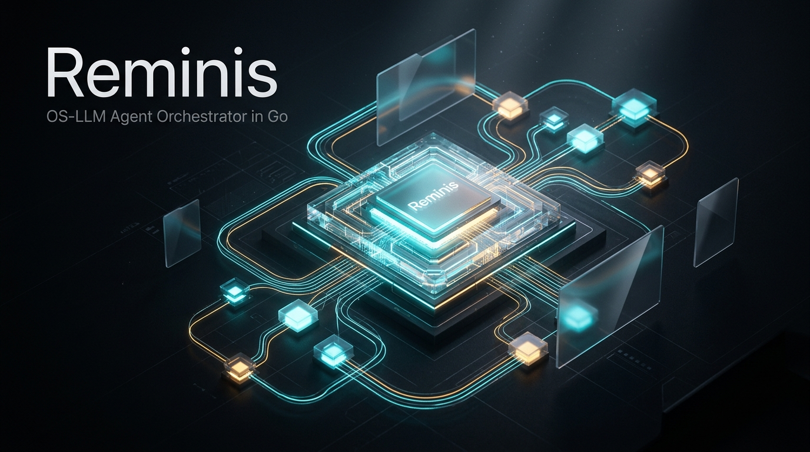

<div align="center">



# Reminis

**High-performance, concurrent OS-LLM agent memory layer and DAG orchestrator in pure Go.**

[](https://goreportcard.com/report/github.com/SalvucciFacundo/Reminis)
[](https://golang.org)
[](LICENSE)
[](https://modelcontextprotocol.io)

</div>

---

## Overview

Modern LLM agent loops suffer from the **quadratic context problem**: chat histories accumulate turn after turn (`[turn_1, turn_2, ... turn_N]`). By turn 30, re-sending tens of thousands of tokens exhausts API rate limits, degrades model attention (*needle-in-a-haystack* failure), and explodes operational costs.

**Reminis** eliminates context bloat by implementing the **OS-LLM Architecture**:
- **CPU (Stateless Compute):** The LLM acts purely as an execution processor.
- **RAM / L1 (Working Memory):** Thread-safe in-memory Blackboard guarded by `sync.RWMutex`, isolated by task namespaces with automatic 4KB disk spillover.
- **Disk (Archival Persistence):** Pure-Go SQLite in WAL mode with a dedicated single-writer channel preventing `SQLITE_BUSY` errors.
- **Ephemeral Workers:** Bounded goroutines (max 3 tool turns) whose entire conversation context is garbage collected immediately upon task completion.

Instead of dragging 50,000+ tokens across a workflow, Reminis dispatches parallel, isolated workers where each request consumes only **~300–800 tokens** containing strictly the dynamic inputs required for that specific step.

---

## Core Features

- **Zero Context Degradation:** Micro-tasks execute within ephemeral contexts that are discarded immediately after writing results to the Blackboard.
- **Dynamic DAG Scheduler:** Kahn's topological sort validation, dependency resolution, cascading skips on failure, and dynamic sub-task fan-out/fan-in (`scheduler.Expand`).
- **Enriched Prefix Caching (>1,024 Tokens):** Guarantees provider prompt caching discounts (50%–90% cost/latency reduction on Claude, Gemini, OpenAI) by keeping static prefixes invariant while appending dynamic tails.
- **Universal Rules Discovery:** Hierarchical precedence cascade resolving CLI flags, project files (`.reminis.yaml`, `AGENTS.md`, `CLAUDE.md`, `.cursorrules`, `.windsurfrules`), global configs (`gentle-ai`), and baseline fallbacks.
- **3-Level Resilience Engine:**
  - *Level 1:* Exponential backoff with randomized jitter on HTTP 429/500 errors (zero LLM tokens burned).
  - *Level 2:* Local targeted reflection (max 2 attempts) for JSON parsing or graph cycle errors.
  - *Level 3:* Checkpoint freezing in SQLite with atomic resumption (`reminis resume <run_id>`).
- **Human-in-the-Loop Gates:** Granular approval scopes (`action`, `session`, `permanent`) with dual execution: interactive terminal prompt (`[y/N]`) or headless checkpoint pause.
- **Production Guardrails:** Silence watchdog (inactivity timeout resetting on output bytes), process group isolation (`Setpgid: true` killing entire process trees on cancel), and workspace file mutexes.
- **Model Context Protocol (MCP):** Stdio JSON-RPC 2.0 server with strict `stdout` protocol hygiene, ready to plug into Antigravity, Claude Desktop, Cursor, and Codex.

---

## Architecture Diagram

```
                       ┌────────────────────────┐
                       │    User / Objective    │
                       └───────────┬────────────┘
                                   │
                                   ▼
                       ┌────────────────────────┐
                       │     Planner Engine     │
                       │  (Generates typed DAG) │
                       └───────────┬────────────┘
                                   │
                                   ▼
                       ┌────────────────────────┐
                       │   Task Graph (DAG)     │
                       │  Dependency Resolution │
                       └───────────┬────────────┘
                                   │
               ┌───────────────────┴───────────────────┐
               ▼                                       ▼
    ┌──────────────────────┐                ┌──────────────────────┐
    │  Worker (Task A)     │                │  Worker (Task B)     │
    │  • Static Prefix     │                │  • Static Prefix     │
    │  • Dynamic Tail      │                │  • Dynamic Tail      │
    │  • Max 3 Tool Calls  │                │  • Max 3 Tool Calls  │
    │  • Context Discarded │                │  • Context Discarded │
    └──────────┬───────────┘                └──────────┬───────────┘
               │                                       │
               └───────────────────┬───────────────────┘
                                   ▼
                       ┌────────────────────────┐
                       │   Thread-safe State    │
                       │     (Blackboard)       │
                       └───────────┬────────────┘
                                   │
                                   ▼
                       ┌────────────────────────┐
                       │     Pure-Go SQLite     │
                       │   (WAL Mode Storage)   │
                       └────────────────────────┘
```

---

## Installation

### Prerequisites
- Go 1.23+

### Install via `go install`
```bash
go install github.com/SalvucciFacundo/Reminis/cmd/reminis@latest
```

### Build from Source
```bash
git clone https://github.com/SalvucciFacundo/Reminis.git
cd Reminis
go build -o bin/reminis ./cmd/reminis
```

---

## Quick Start (CLI)

### 1. Execute a Goal
```bash
reminis run "Audit internal/store/store.go and generate unit tests" \
  --model gpt-4o \
  --max-concurrency 4
```

### 2. Inspect the Compiled Prompt Prefix
Verify discovered rules, estimated token count, and prompt cache qualification:
```bash
reminis prefix show
```

### 3. Resume an Interrupted Run
```bash
reminis resume run_a1b2c3d4e5
```

### 4. Approve Gated Tasks
```bash
reminis approve run_a1b2c3d4e5 task_deploy_01 --scope session
```

### 5. Query Long-Term Memory
```bash
reminis mem search "architecture"
reminis mem save "database" "Uses pure-Go SQLite with WAL mode and single-writer channel"
```

---

## Model Context Protocol (MCP) Integration

Reminis exposes a standard stdio JSON-RPC 2.0 MCP server with strict `stdout` protocol hygiene (internal diagnostics and telemetry are directed to `stderr`).

### Add to Claude Desktop (`claude_desktop_config.json`)
```json
{
  "mcpServers": {
    "reminis": {
      "command": "reminis",
      "args": ["mcp"],
      "env": {
        "OPENAI_API_KEY": "your-api-key"
      }
    }
  }
}
```

### Add to Antigravity / Cursor
```json
{
  "name": "reminis",
  "command": "reminis",
  "args": ["mcp"]
}
```

### Available MCP Tools
| Tool Name | Description |
| :--- | :--- |
| `reminis_run` | Plan and orchestrate a workflow goal through bounded ephemeral workers |
| `reminis_resume` | Resume execution of a checkpointed run from SQLite |
| `reminis_approve` | Approve a gated task in `WAITING_APPROVAL` with scope (`action`, `session`) |
| `reminis_facts_search` | Search persistent architectural facts by topic or scope |
| `reminis_facts_save` | Store a durable architectural observation into SQLite memory |
| `reminis_prefix_show` | Audit the active universal rules cascade and cache stability |

---

## Go SDK (`pkg/client`)

Integrate Reminis directly into your Go applications:

```go
package main

import (
    "context"
    "fmt"
    "log"

    "github.com/SalvucciFacundo/Reminis/pkg/client"
)

func main() {
    ctx := context.Background()

    c, err := client.New(
        client.WithDBPath("reminis.db"),
        client.WithModel("gpt-4o"),
        client.WithMaxConcurrency(4),
    )
    if err != nil {
        log.Fatalf("failed to initialize client: %v", err)
    }
    defer c.Close()

    res, err := c.Run(ctx, client.RunRequest{
        Goal: "Analyze codebase dependencies and list circular references",
    })
    if err != nil {
        log.Fatalf("run failed: %v", err)
    }

    fmt.Printf("Run ID: %s | Status: %s\n", res.RunID, res.Status)
    fmt.Printf("Completed Tasks: %v\n", res.CompletedTasks)
}
```

---

## Documentation

- [Architecture & Design Details](docs/architecture.md)
- [CLI Reference Guide](docs/cli.md)
- [MCP Server Specification](docs/mcp.md)
- [Go Client SDK Documentation](docs/sdk.md)
- [Formal Specification (SPEC.md)](SPEC.md)

---

## Project Structure

```
reminis/
├── cmd/
│   └── reminis/          # CLI application entrypoint
├── internal/
│   ├── blackboard/       # Thread-safe working memory ledger with 4KB spillover
│   ├── dag/              # DAG scheduler, Kahn cycle detection & resource locks
│   ├── discovery/        # Hierarchical rules discovery & compiler
│   ├── mcp/              # Stdio JSON-RPC 2.0 Model Context Protocol server
│   ├── memory/           # Long-term fact persistence & prompt context extractor
│   ├── orchestrator/     # Central pipeline, event streaming & resume engine
│   ├── planner/          # Structured DAG synthesis & reflection engine
│   ├── prompt/           # Enriched prefix stability synthesizer
│   ├── rules/            # Universal rules cascade & cache padding
│   ├── session/          # Session lifecycle & granular approval manager
│   ├── store/            # Pure-Go SQLite WAL store with single-writer channel
│   └── worker/           # Ephemeral LLM worker, tool executor & silence watchdog
├── pkg/
│   └── client/           # Public client SDK for Go agent integrations
├── docs/                 # Documentation guides & visual assets
├── go.mod
└── README.md
```

---

## License

MIT License. See [LICENSE](LICENSE) for details.
