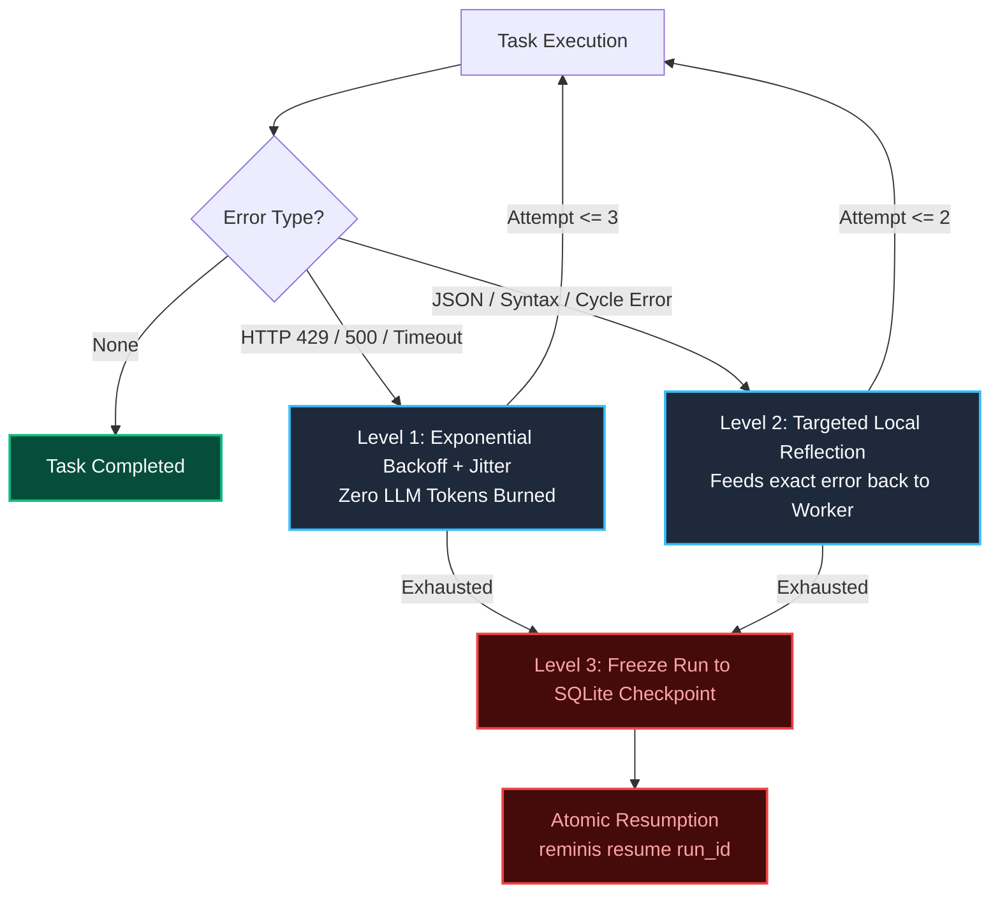
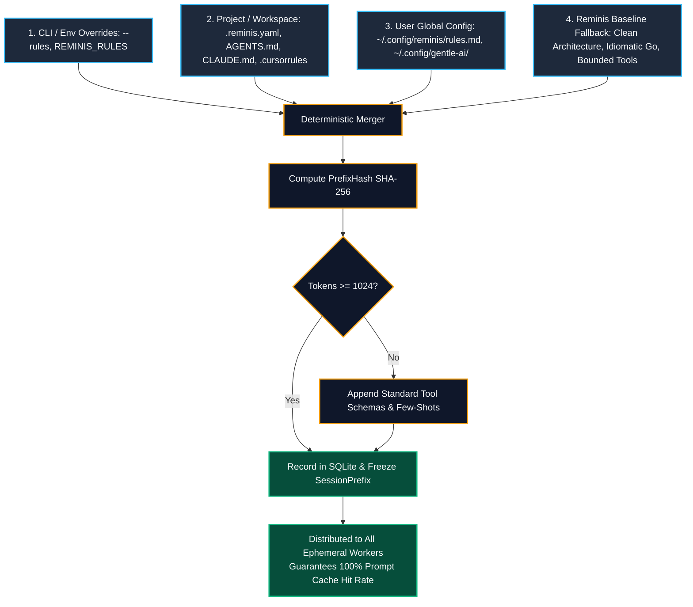

# Reminis Architecture & Deep-Dive Guide

This document provides a comprehensive technical overview of the **Reminis** OS-LLM architecture, execution model, concurrency mechanisms, and memory subsystems.

---

## 1. The Quadratic Context Problem

Traditional autonomous agent loops (such as ReAct) operate by continuously appending conversation turns to an ever-expanding chat history:

$$\text{Tokens}(N) \propto \sum_{i=1}^N \text{turn}_i \approx O(N^2)$$

By turn 25 or 30, each individual agent invocation forces the model to process tens of thousands of redundant tokens. This creates three severe failure modes:

1. **Attention Degradation ("Lost in the Middle"):** Large context windows degrade the model's ability to recall subtle constraints, leading to hallucinations, self-contradictory logic, and syntax degradation.
2. **Rate Limit & Bandwidth Exhaustion:** Resending 40,000+ tokens per step rapidly exhausts Tokens-Per-Minute (TPM) limits on cloud APIs (Anthropic Claude, OpenAI, Google Gemini) or saturates memory bus bandwidth on local inference engines (Ollama, `llama-server`).
3. **Runaway Cost & Latency:** Each turn incurs linearly escalating latency and compounding cost, making complex multi-step workflows economically impractical.

---

## 2. The OS-LLM Solution

Reminis restructures agent execution around operating system design fundamentals:

| Component | OS Analogue | Implementation in Reminis |
| :--- | :--- | :--- |
| **LLM Inference** | **CPU** | Stateless computation engine. Receives minimal input; discards context immediately upon execution. |
| **Blackboard** | **RAM / L1 Cache** | In-memory concurrent key-value ledger guarded by `sync.RWMutex` with 4KB disk spillover. |
| **SQLite Store** | **Disk / File System** | Pure-Go SQLite in WAL mode with a single-writer channel for durable checkpointing. |
| **Workers** | **Ephemeral Goroutines** | Isolated tasks bounded to max 3 tool turns; context is garbage collected on return. |

---

## 3. Working Memory: The Blackboard

The **Blackboard** (`internal/blackboard`) represents the ground truth for an active workflow execution.

### Namespace Isolation
To prevent race conditions, each task writes strictly to its designated namespace:
```
tasks.<task_id>.output
```
Concurrent parallel tasks are strictly prohibited from mutating identical keys.

### 4KB Pass-by-Reference Spillover
To keep memory usage minimal and prevent working memory bloat:
1. Payloads smaller than or equal to 4,096 bytes (`len(data) <= 4096`) are stored in-memory as `json.RawMessage`.
2. Payloads exceeding 4,096 bytes (e.g. extensive code diffs, large test outputs, raw CSVs) are automatically spilled to disk under:
   ```
   ~/.reminis/runs/<run_id>/artifacts/<sanitized_key>.artifact
   ```
3. The Blackboard stores a `MemoryEntry` with `IsSpilled: true` and the `SpillPath`. Downstream workers transparently read from disk when streaming the artifact.

---

## 4. Directed Acyclic Graph (DAG) Scheduler

The execution graph (`internal/dag`) manages task sequencing and parallel dispatching.

### Topological Cycle Validation (Kahn's Algorithm)
Before scheduling tasks, Kahn's algorithm validates that the graph has zero cycles. If a circular dependency is detected, `ValidateAcyclic` returns `ErrCycleDetected`, triggering Level 2 planner reflection before any worker is spawned.

### Dynamic Sub-DAG Expansion (`scheduler.Expand`)
When an exploration task discovers additional work beyond its 3-turn budget (e.g. inspecting 15 files across a repository):
1. The worker yields subtasks (`YieldedTasks []Task`).
2. The scheduler suspends the parent task.
3. The yielded subtasks are dynamically spliced into the active DAG using incremental Kahn validation.
4. Leaf child tasks are wired to unblock the parent or designated reducer task upon completion.

### Workspace Resource Locks
Parallel workers targeting the same files acquire cooperative locks via `dag.ResourceLock`. Unique paths are sorted lexicographically before acquisition to guarantee zero ABBA deadlocks.

---

## 5. 3-Level Resilience Engine

Reminis protects workflows against network flakes, model hallucinations, and environment crashes:



---

## 6. Prompt Caching: Enriched Prefix Stability Pattern

Providers like Anthropic, Google Gemini, and OpenAI offer prompt caching discounts (50%–90% cost and latency savings) when prompt prefixes are static and meet size thresholds (e.g., Anthropic enforces a strict 1,024-token minimum).

Reminis enforces the **Prefix Stability Pattern**:

1. **Invariant Static Prefix (Cached, System Message):**
   - Universal Rules (resolved from project/global configs).
   - Project Manifest (language, frameworks, architecture).
   - Tool Schemas and Argument Constraints.
   - Few-shot execution examples.
   - *Token Guarantee:* If the prefix is under 1,024 tokens, the compiler automatically pads it with standardized schemas to guarantee cache activation.
2. **Dynamic Tail (Non-Cached, User Message):**
   - Injected Blackboard slice (`Task.InputKeys`).
   - Current task action directive and target boundaries.

---

## 7. Storage Engine: Pure-Go SQLite

Persistence (`internal/store`) uses pure-Go SQLite (`modernc.org/sqlite`) without CGO dependencies.

- **WAL Mode:** Enabled via `PRAGMA journal_mode=WAL;` for concurrent multi-reader access.
- **Single-Writer Channel:** Write operations are funneled through a Go channel (`chan writeOp`) consumed by a dedicated background goroutine. Combined with `PRAGMA busy_timeout=5000;`, this eliminates `SQLITE_BUSY` errors during concurrent worker completion bursts.

---

## 8. Universal Rules Discovery Cascade

To ensure workers adhere to user conventions without breaking existing developer setups (Gentle AI, Cursor, Claude Code, etc.), Reminis resolves configuration using a strict precedence cascade:



